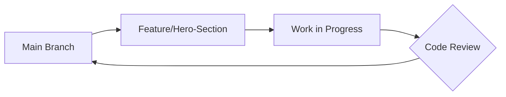

# QuickPOS - Next-Gen Point of Sale Interface


> **The operating system for modern business.**
> 
> A high-performance, pixel-perfect landing page featuring a **Glassmorphism UI**, **Staggered Animations**, and **PHP-driven backend logic**. Built strictly following Agile/Scrum methodologies with GitFlow architecture.

---

## 📑 Table of Contents

- [Live Demo](#-live-demo)
- [Project Overview](#-project-overview)
- [Key Features](#-key-features)
- [Agile Methodology & Process](#-agile-methodology--process-rigor)
- [Technical Architecture](#-technical-architecture)
- [Installation & Setup](#-installation--setup)
- [The Team](#-the-team)
- [Project Gallery](#-project-gallery)
- [License](#-license)

---

## 🚀 Live Demo

**[CLICK HERE TO LAUNCH QUICKPOS](https://your-website-link-here.com)** 

*(Note: Link updated upon final deployment)*

---

## 💡 Project Overview

**QuickPOS** is designed to solve the problem of clunky, outdated POS software marketing. This project serves as the primary marketing funnel, designed to convert visitors into leads via a high-end User Experience (UX).

The goal was not just to write code, but to simulate a real-world **Software Development Life Cycle (SDLC)**. We utilized **Jira** for task tracking, **GitHub** for version control, and **Slack** for team synchronization.

---

## ✨ Key Features

### 🎨 Frontend (UI/UX)

- **Glassmorphism Aesthetic:** Utilizes `backdrop-filter: blur()` and semi-transparent RGBA backgrounds to create depth and hierarchy.
- **Dynamic "Tech-Grid" Background:** Custom CSS radial-gradients create a modern SaaS grid pattern that fades into the background.
- **3D Transform Animations:**
  - **Hero Section:** Floating dashboard cards (`perspective: 1000px`) that react to mouse position.
  - **Feature Cards:** "Holographic" inner glow effects using pseudo-elements (`::before`) and CSS transitions.
- **Mobile-First Responsiveness:** Fully adaptive Flexbox and CSS Grid layouts that stack perfectly on mobile (`@media (max-width: 768px)`).

### ⚙️ Backend (PHP Logic)

- **Secure Form Handling:** The `contact.php` engine processes `POST` requests securely.
- **Server-Side Validation:**
  - Sanitizes email inputs via `filter_var()`.
  - Strips HTML tags to prevent XSS attacks via `strip_tags()`.
  - Validates required fields before processing.
- **Session Feedback:** Redirects users to a custom `thank-you.html` upon successful submission.

---

## 🔄 Agile Methodology & Process Rigor

We strictly adhered to the **Scrum Framework**, executing **two 1-week sprints**.

### 1. The Toolchain ("The Virtual Office")

- **Jira Software:** The Single Source of Truth. All Epics, Stories, and Tasks were logged here.
- **GitHub:** Integrated with Jira. Every commit message includes a Jira Ticket ID (e.g., `[POS-13]`) for traceability.
- **Slack:** Used for Daily Standups and automated webhooks from GitHub/Jira.

### 2. Branching Strategy (GitFlow)

We enforced a **Protected Main Branch** policy. No direct commits were allowed.



### 3. Sprint Breakdown

- **Sprint 1 (Visuals):** Setup, Navigation, Hero Section, Features Grid.
- **Sprint 2 (Logic):** Pricing Tables, PHP Contact Form, Footer, Final Polish.

---

## 🏗 Technical Architecture

### Tech Stack

| Component | Technology | Description |
|-----------|------------|-------------|
| Markup | HTML5 | Semantic structure (Section, Nav, Footer) |
| Styling | CSS3 | Custom variables, Flexbox, CSS Grid, Keyframes |
| Logic | PHP 8.0 | Form processing and validation |
| Icons | FontAwesome 6 | Vector icons for UI elements |
| Typography | Google Fonts | 'Poppins' for modern readability |

### Directory Structure

```
QuickPOS/
├── assets/
│   ├── css/
│   │   └── style.css       # Core stylesheet (200+ lines of custom CSS)
│   ├── images/             # Optimization assets & screenshots
│   └── js/
│       └── script.js       # UI interactions (if applicable)
├── includes/               # Reusable PHP components
├── contact.php             # Form Processor (POST Handler)
├── index.php               # Main Entry Point
├── thank-you.html          # Success State
└── README.md               # Documentation
```

---

## 💻 Installation & Setup

To run this project locally, you need a PHP environment (XAMPP, MAMP, or built-in PHP).

### 1. Clone the Repository

```bash
git clone https://github.com/NadeemAhmad3/QuickPOS.git
cd QuickPOS
```

### 2. Start Development Server

```bash
php -S localhost:8000
```

### 3. Access the Application

Open your browser and navigate to: `http://localhost:8000`

---

## 👥 The Team

| Role | Member | Github | Responsibilities |
|------|--------|--------|------------------|
| Product Manager | Mastercoder | [@mastercoder](https://github.com/mastercoder) | Backlog Ownership, QA, Sprint Planning |
| Tech Lead | OnedaySuccessfull | [@onedaysuccessfull](https://github.com/onedaysuccessfull) | DevOps, Merge Reviews, Repo Management |
| Lead Developer | Nadeem | [@NadeemAhmad3](https://github.com/NadeemAhmad3) | Full Stack Development (PHP/CSS) |

---

## 📸 Project Gallery

### 1. The Agile Board (Jira)
*Evidence of Sprint Planning and Backlog Management.*

### 2. Hero Section (Visuals)
*Glassmorphism UI with staggered entrance animations.*

### 3. GitHub Network (GitFlow)
*Visualization of feature branching and merge history.*

---

## 📄 License

This project is licensed under the MIT License - see the [LICENSE](LICENSE) file for details.

---

## 🙏 Acknowledgments

- Built for Web Engineering Coursework
- Inspired by modern SaaS landing pages
- Special thanks to our instructors and mentors

---

<p align="center">
  <strong>© 2025 QuickPOS Team. All rights reserved.</strong>
</p>

<p align="center">
  Made with ❤️ for modern businesses
</p>
